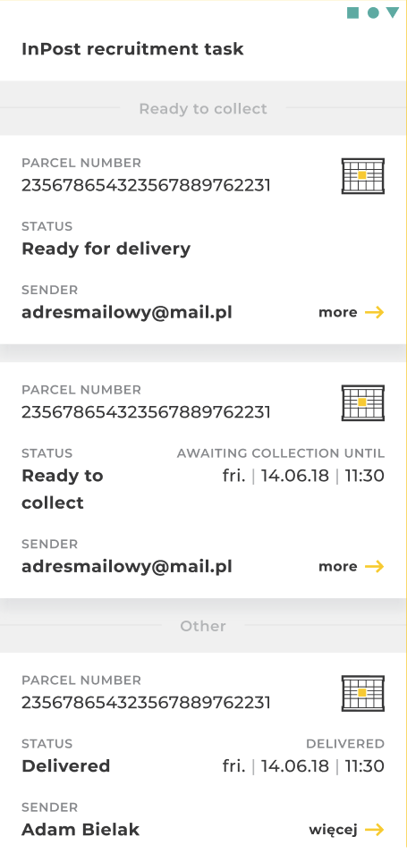

# InPost Recruitment Task

## Intro
We travel back in time ⏱️. InPost Mobile app was just created and you join the team to improve its feature set and make it ready for the future.
User base is growing fast and every day more people start to use it daily.

You, as an experienced developer, were assigned to the project to improve its quality. The initial code is not perfect and is far from being.
Organize and refactor code the way you like to work (packages, modules, layers, data flow, names, methods order etc.).

## Rules
- You can change and move any part you like (except JSON file), install any open source library you want
- A static JSON file is returned in response, **consider this is a real production environment** returning your data
- JSON file cannot be changed
- Git history is also important
- Feel free to comment your choices

## Tasks
1. Add grouping to the list of Shipments by flag **ShipmentNetwork.operations.highlight**
2. Style list items as in Figma (link: https://www.figma.com/file/E7vZMYESnKvmzn70FenrhP/InPost)
3. Sort list items in groups by (the closest date to current date should be at top of the list):
    * status - order is described in `ShipmentStatus.kt` file (the higher order, the higher it should be on the list)
    * pickupDate
    * expireDate
    * storedDate
    * number
4. Add pull to refresh and handle refresh progress
5. Add storing shipments locally (use Room)
6. Add local archiving of the shipment:
    * We consider archiving as hiding the shipment from the list of `Shipment`s
    * Design is not important here
    * `Shipment` must stay hidden after re-downloading data or relaunching the app
    * Use flag **ShipmentNetwork.operations.manualArchive**
7. Create unit tests

## Links and resources
- Fonts folder: [/app/src/main/res/font](./app/src/main/res/font)

If for some reason Figma link stops working, here you can see the requested design:

# Good luck! 💪

## GitFlow Convention

This project follows the [GitFlow branching model](https://nvie.com/posts/a-successful-git-branching-model/) to manage the codebase efficiently. GitFlow helps maintain a clean repository with well-defined processes for feature development, releases, and hotfixes. Below is an overview of the key branches and workflows:

### Main Branches
- **`main`**: Contains the production-ready code. All changes here are thoroughly tested and approved.
- **`develop`**: Serves as the integration branch for new features. All feature branches are merged into `develop` once complete.

### Supporting Branches
Supporting branches are used to manage new development, bug fixes, and releases. They are categorized as:

- **Feature Branches** (`feat/your-feature-name`):
   - **Branch off from**: `develop`
   - **Merge back into**: `develop`
   - **Naming convention**: `feature/<feature-name>`
   - Used to develop new features or enhancements.

- **Release Branches** (`release/x.x.x`):
   - **Branch off from**: `develop`
   - **Merge back into**: `main` and `develop`
   - **Naming convention**: `release/<version-number>`

- **Hotfix Branches** (`hotfix/x.x.x`):
   - **Branch off from**: `main`
   - **Merge back into**: `main` and `develop`
   - **Naming convention**: `hotfix/<version-number>`

## Commit Message Types

- **feat**: A new feature.
- **fix**: A bug fix.
- **perf**: A code change that improves performance.
- **revert**: Reverts a previous commit.
- **refactor**: Refactoring production code, e.g., renaming a variable.
- **build**: Changes that affect the build system or external dependencies.
- **docs**: Documentation only changes.
- **style**: Changes that do not affect the meaning of the code (e.g., white-space, formatting, missing semi-colons, etc.).
- **chore**: Updating grunt tasks, configuration changes, or changes that do not affect production code. Most admin work falls under this category.
- **test**: Adding missing tests or correcting existing tests.
- **ci**: Changes to our CI configuration files and scripts.
- **hotfix**: Used for critical fixes in the `main` branch without disrupting ongoing development.
- **release**: Used to prepare for a new production release, allowing for final testing and minor bug fixes.